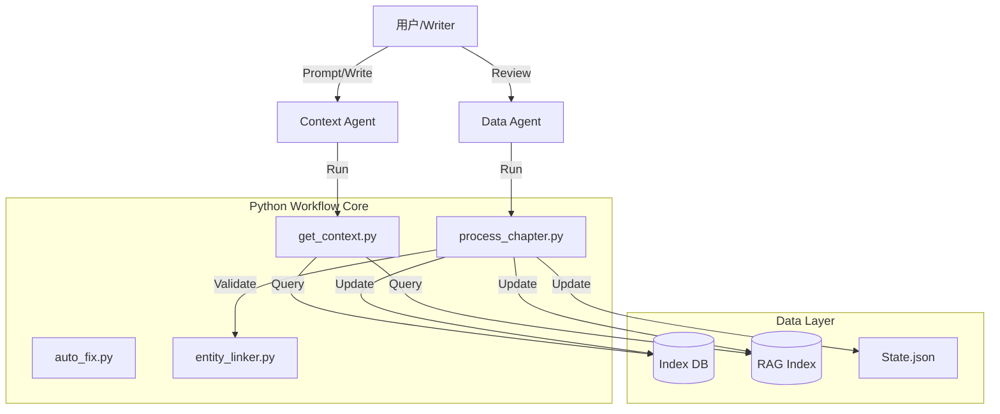

# NovelGod: AI Agentic Novel Assistant (v6.0)

[](LICENSE)
[](https://www.python.org/)
[]()

**NovelGod** 是专为长篇网文创作设计的 AI Agent 编排系统，能够支持 **200+ 万字** 量级的连载创作。它不仅仅是一个写作助手，更是一个包含 **数据治理、主动记忆、逻辑审查** 的完整创作管线。

> **v6.0 更新 (2026-01)**: 
> 全面重构为 "Python-Native" 架构，引入了主动实体链接、自动格式修复和统一 CLI 工具链。

## 🌟 核心特性 (Key Features)

### 1. 动态双模 Context (Dynamic Context)
告别 AI "金鱼记忆"。系统采用 **RAG (语义检索)** + **Timeline (事件流)** + **State (状态快照)** 三位一体的记忆机制：
- **Immediate Context**: 精确记忆最近 3 章的每一个细节。
- **Volume Flow**: 概括记忆本卷前 10 章的关键剧情流。
- **Global Memory**: 通过 SQL 和 向量数据库 检索全局伏笔和设定。

### 2. 主动实体一致性 (Active Entity consistency)
- **实时监控**: 写入时自动检测 "萧炎" vs "肖炎" 等同名异字错误。
- **自动合并**: 提供 CLI 工具合并重复实体，保持角色状态唯一性。
- **状态追踪**: 自动记录角色境界、位置、关系的变化。

### 3. 自动化闭环 (Automation)
- **Auto-Fix**: 自动修复中文标点、引号、段落格式错误。
- **Data Agent**: 自动从正文中提取实体和关系，无需人工维护 Wiki。
- **Git Ops**: 每章自动原子提交，支持一键回滚。

## 🚀 快速开始 (Quick Start)

### 1. 安装
确保 Python 3.9+ 环境。

```bash
# 克隆仓库
git clone https://github.com/your-repo/novelgod.git
cd novelgod

# 安装依赖
pip install -r requirements.txt

# 配置环境变量 (可选，用于 RAG)
cp .env.example .env
```

### 2. 初始化项目
在你的小说目录下运行：

```bash
# 交互式初始化
/webnovel-init
```

### 3. CLI 工具使用 (v6.0 新增)
使用统一的 CLI 入口管理项目：

```bash
# 查看项目统计
python -m scripts.cli stats

# 自动修复章节格式
python -m scripts.cli fix 正文/第0001章.md --inplace

# 检查实体冲突
python -m scripts.cli link check

# 手动处理数据入库 (高级)
python -m scripts.cli ingest --file 正文/第0001章.md --json analysis.json
```

### 4. 常用 Slash Commands
在 Agent 环境中直接使用：

| 命令 | 说明 |
|------|------|
| `/webnovel-plan [卷号]` | 生成/更新卷纲 |
| `/webnovel-write [章号]` | 启动章节创作工作流 |
| `/webnovel-review` | 启动 5 维度并行审查 |
| `/webnovel-status` | 查看进度报告 |
| `/webnovel-qa [问题]` | 向知识库提问 |

## 📐 架构设计 (Architecture)



## 📂 目录结构

```
novel_project/
├── .claude/
│   ├── agents/             # Agent Prompts (Prompt Engineering)
│   ├── scripts/            # Python Core Logic
│   │   ├── workflow/       # 业务流 (get_context, process_chapter)
│   │   ├── data_modules/   # 数据层 (index_manager, rag_adapter)
│   │   └── cli.py          # CLI 入口
│   └── skills/             # Slash Command Definitions
├── .webnovel/              # 运行时数据 (自动管理，勿手改)
├── 正文/                   # Markdown 章节稿件
├── 大纲/                   # YAML/Markdown 大纲
└── 设定集/                 # 设定参考
```

## 🛠️ 最佳实践

1.  **大纲先行**: 永远先用 `/webnovel-plan` 更新大纲，再写正文。Context Agent 强依赖大纲生成上下文。
2.  **及时入库**: 章节写完后，必须完成 Data Agent 步骤（或运行 `process_chapter`），否则下一章会“遗忘”刚才发生的剧情。
3.  **勤用 Auto-Fix**: 提交前运行 `python -m scripts.cli fix`，保持排版整洁。

## License

GPL v3
